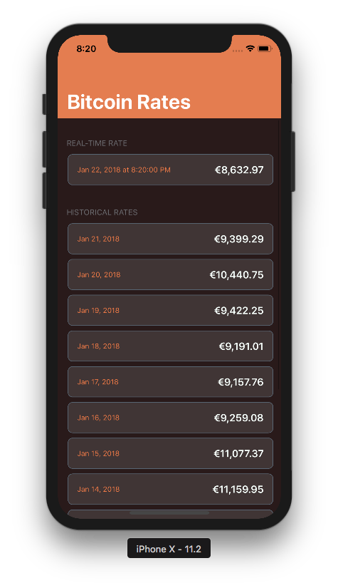

# Bitcoin Redux

---
## Introduction
This is a sample project for demonstrating SwiftRex framework.

---
## Running

Running this project should be as simple as downloading the source code, opening `BitcoinRExchange/BitcoinRExchange.xcodeproj` on Xcode 9.2, selecting the correct Scheme (`BitcoinRExchange`) and typing `Cmd+R`. As no third-party libraries were used, and the internal frameworks are part of the project (not integrated via package managers), no other action is required.

---
## Playground First

My first approach facing a new API to be used is to try it on Xcode Playground. So I wrote a very simple playground package, which should be available together with the source code on path `Playgrounds/BitcoinRateAPI.playground`. This is meant to be used in Xcode 9.2 as well and has only the minimum network and Json Parser layer. Most of these classes were used later on on the final project, but evidently some changes were made and the playground got outdated really quickly. Still, it can be used for fun.

---
## Architecture

### Redux
Uni-directional Data Flow is a pattern introduced by web frameworks such as Flux and Redux, and later brought to the mobile world by libraries such as [ReSwift]("https://github.com/ReSwift/ReSwift") and [Suas]("https://suas.readme.io/docs/getting-started"). This architecture can be used on top of any other popular architecture for iOS (MVC, MVVM, MVP or VIPER), but on MVC is more simple so we don't have too much boilerplate code and the separation between the *state*, the *View* and the *state mutation* is already enough to make our ViewControllers more lightweight and the whole app completely testable.


Everything that can be mutated in your app is part of the app state, and managing this state is one of the biggest challenges in a big project where you want to avoid multiple sources of truth, stale data, inconsistency, synchronization conflicts and other problems that can lead to bugs really hard to find and resolve.

For that reason, when using uni-directional data flow we group the whole app state in a store (state machine) and nobody is allowed to mutate it directly. Instead, we use `Actions` to request changes. An Action is usually a very tiny value object describing the change, which may or may not contain associated values. For that reason, Swift `enum` is the perfect data structure for the job.

In a complex Redux Framework, there's the concept of Middleware, which we will skip now as we don't use it in this project. So the next step is mutating the `AppState` according to the `Action` and for that we use `Reducers`. In functional programming, a reducer is a function that takes an initial value and an operation, and returns the result value of the same type as the first input. Here we want the same, something that receives the current state, the action, and returns the new state. The `Store` orchestrates this whole symphony, holding both, current state and the list of reducers, receiving the actions from the views and coordinating the workflow.

Once all the `Reducers` had the opportunity to reduce the state according to the `Action`, the store will set the current state to the new one. This part is really important: you will **never** end up with intermediate states, as the current state remains unchanged until all the whole process is done. Different from some Reactive Libraries, here you always have a consistent state and don't have to be worried with partially changed objects.

We are almost there, there's a final step in this workflow, and it's a very important one: notify whoever is interested.

Differently from the other frameworks I mentioned before, my implementation of redux uses the concept of `Signal` to broadcast a change. `Signal` is a data structure popular from ReactiveCocoa, RxSwift and other web libraries and it's basically a continuous version of a `Promise`, that dispatches not only once but every time that a value changes. My implementation was strongly inspired by Swift Talk episodes [#39](https://talk.objc.io/episodes/S01E39-from-futures-to-signals), [#40](https://talk.objc.io/episodes/S01E40-signal-ownership-and-subscriptions) and [#42](https://talk.objc.io/episodes/S01E42-thread-safety), although I went beyond and changed my `Signal<T>` class to be a [functor and a monad](http://www.mokacoding.com/blog/functor-applicative-monads-in-pictures/), in a way that you can subscribe sub-states.

For example, a `ViewController` wanna observe only certain property of your state, so the subscription call will be something like:
```swift
stateSignal
    .map { s in s.substate.grandChild }
    .subscribe { [weak view] grandChild in
        view?.update(grandChild)
    }
```

A `subscript` function using `keyPath` improves this syntax:
```swift
stateSignal[\.substate.grandChild]
    .subscribe { [weak view] grandChild in
        view?.update(grandChild)
    }
```

### Dependency Injection

Inspired by [this article](http://www.danielhall.io/a-swift-y-approach-to-dependency-injection) I wrote a Dependency Injection layer using Protocol Extensions to add traits to a client in a very transparent way. If you want to use the API from a class, all you must do is:
```
class MyClass {
    func checkWeather() {
        apiClient.request(.weather) { w in
            print(w)
        }
    }
}

extension MyClass: HasApiClient { }
```

The last line adds the `apiClient` property to `MyClass`.


### Project structure

Executables:
* BitcoinRExchange: the iOS app package (Resources and code)
* BitcoinWatch: the watchOS app (Resources Bundle)
* BitcoinWatch Extension: the watchOS app extension (code)

Frameworks:
* BitcoinLibrary: has the code specific for the Bitcoin app, the business models, the web client, the JSON parsers for the model, the state management and more. It compiles in two Targets:
    * BitcoinLibrary iOS
    * BitcoinLibrary watchOS
* CommonLibrary: is the core library with helpers and frameworks that are not app-specific. Part of this code I write and maintain for my personal projects, such as the Redux library, the DI library and several Foundation and UIKit helpers. It compiles in two Targets:
    * CommonLibrary iOS
    * CommonLibrary watchOS


### UI

For the iOS project the UI has no Storyboards, but XIBs. This is a personal choice, my preference for XIBs has some arguments:
* Storyboards tend to grow and become really complex when the workflow of your app is not so basic anymore.
* Big Storyboards in big teams means merge conflicts of XML. Xcode changes several nodes of the XML even if you simply open the Interface Builder.
* The argument that designers and stakeholders can see the navigation flow by opening Storyboards is not reality in any company I've worked for.
* Splitting in several Storyboards doesn't solve the problem, only postpone it.
* Segues enforce you to use the ViewController for coordinating the navigation, more than giving a ViewController another responsability, it couples the second ViewController into the first one.
* Deep-linking is complex when using with Segues.

For UI, I used XIBs instead of Storyboards, and plain `UIViewController` instead of `UITableViewController`, so I can free the ViewController from the burden of being also the `UITableViewDataSource` for its tableView. All a ViewController does is responding to the state signal changes (updating itself and children) and dispatching `Actions` for user interactions. For color customization and animations I prefer having `UIView` subclasses.

I try to use StackViews as much as I can, or fallback to AutoLayout for design or performance fine-tuning. Size classes when needed and now Safe Area insets to make compatible with iPhone X.





---
## Unit Tests

For this project no frameworks are being used. Usually I like having some "assertion" helpers such as [Nimble](https://github.com/Quick/Nimble).

The code coverage is good, but there's room for improvements.


What is interesting to note is the testing strategy for each layer:
* Json parser: give a string and check if the parser behaves as expected for happy path and errors;
* Web client: individually if the endpoints are assembling the URLRequest correctly; hot tests to check if the response has the expected http code and integration tests that fetch real data, parse the Json and validate (those can be flaky, should run against a controlled "staging" environment);
* Redux Store: check if the subscription is happening correctly and the notifications are handled properly;
* Redux Reducers: give them a state and an action, check if the result state is what you expect to be;
* Redux Action Request: mock the services around to check if the side-effects are being called correctly; also check if the expected actions are dispatched;
* Model equatable: give a pair of instances and compare them;
* Model serialization: extension of the Json parser tests, but specific for the Bitcoin Rates app models;
* Common tests: it's really easy and important to test Foundation extensions, and usually this is one of the cases where I do TDD-by-the-book (test-first, fail-fix-run);
* AppDelegate: simulate calls to the AppDelegate methods and compare the expected Redux Actions to be dispatched;
* UI: instantiate a ViewController and check its mutable properties in several stages of its life cycle. This can be done by mocking everything around, or have a more "Integration Test" flavor, where you only mock the Network layer and let the other dependencies to work as in real life.

For the UI I usually prefer rendering tests over property assertions, not only makes easier to create and maintain the tests, but in the code review gives you screenshots comparing the view before and after the change, which illustrates the code you are reviewing.

One important thing about these Unit Tests: please check that I use an alternative AppDelegate for the tests' main function. This is because I don't want anything from the real AppDelegate to be called during the tests, faking the code coverage statistics or creating singletons that will be harder to mock later.

---
## What should come next
* Rendering Unit Tests using [FBSnapshotTestCase](https://github.com/uber/ios-snapshot-test-case/)
* UI Tests using [KIF](https://github.com/kif-framework/KIF)
* WatchConnectivity to allow the watchOS app to fetch information from the iPhone when available, not only directly from the web
* Today Extension and AppGroups to share the cache
* A chart showing the historical rates
* [Sourcery](https://github.com/krzysztofzablocki/Sourcery) for code-generation. It creates Auto-Equatable, Auto-Hashable, Auto-Mockable, Lenses. With extended templates that I wrote, I can generate even the boilerplate code for new Redux modules. For this project I haven't used because these templates are much more powerful and full of features that were simply not needed for an output-only app.
* Crashlytics
* Localisable strings
* Redux Middleware for Log
* Redux Middleware for Analytics trackers
* Redux Middleware for state monitoring tools
* Better UI (icons, animations)